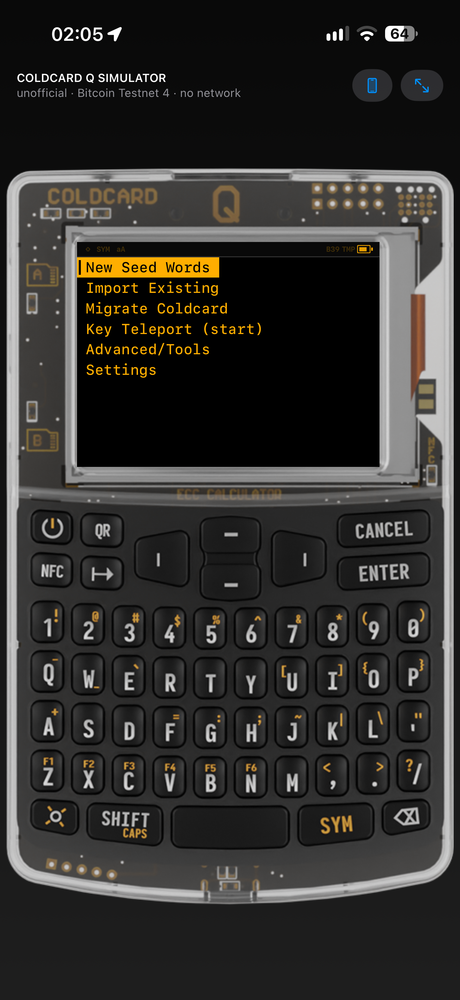
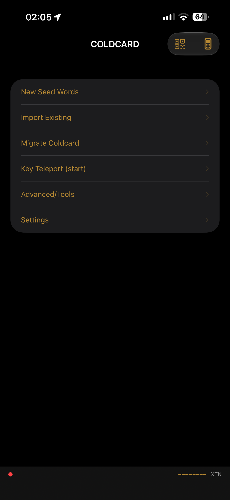

# Coldcard Q Simulator

An **unofficial educational simulator** of Coldcard Q workflows, implemented natively in Swift/SwiftUI for iOS. The firmware checkout is the behavioral reference for formats, text, assets, and tests. The only allowed network use is firmware-style **Push Tx** to a user-configured URL (Testnet by default). There is no analytics client.

The app provides two interfaces backed by the same simulator state: an on-screen Coldcard Q device with its LCD and physical-keyboard controls, and a native iPhone interface. You can switch between them at any time.

> **Educational simulator only — not for custody.** This is not a hardware wallet. Do not import a seed that controls real funds or use this app to receive, store, or sign transactions involving real funds. It does not have or control Coldcard's dedicated secure elements, physical isolation, tamper protection, verified boot, or an independently trusted signing environment. **Bitcoin Testnet** is the default.

## Preview

<p align="center">
  
  
</p>

## Build and run

Requirements:

- macOS with Xcode 16 or later;
- iOS 17 or later;
- an Apple development team selected in Xcode when running on a physical iPhone.

Steps:

1. Open `ColdcardQSimulator.xcodeproj`.
2. Select the **ColdcardQSimulator** target.
3. Under **Signing & Capabilities**, choose your development team.
4. Run the app on an iPhone or in the iOS Simulator.

The QR scanner uses the camera and is therefore best tested on a physical iPhone. In the Simulator, the scanning screen also accepts manually pasted content.

### Demo wallet (test hook)

The public seed from the official desktop simulator is a **non-menu test hook** (`SimulatorStore.officialSimulatorMnemonic` / `createOfficialDemoWallet()`). It is not a firmware virgin or empty-wallet menu row:

```text
wife shiver author away frog air rough vanish fantasy frozen noodle athlete pioneer citizen symptom firm much faith extend rare axis garment kiwi clarify
```

PIN:

```text
12-12
```

This seed is public and intended for testing only. Never send real funds to it.

## Implemented features

### Interface and lifecycle

- Q1 enclosure artwork reused from the official simulator;
- a SwiftUI LCD overlaid on the device's actual screen area;
- tappable regions for Power, QR, NFC, Tab, arrow keys, Cancel, Enter, and the QWERTY keyboard;
- hardware keyboard support for printable characters, arrows, Enter, Escape, Tab, Backspace, Shift, and Symbol;
- an expanded LCD mode for easier use on an iPhone;
- a toggle, available at any time and remembered across launches, between the projected Coldcard Q device and a native iPhone interface driven by the same simulator state;
- first-run setup, seed creation/import, PIN setup, locking, and unlocking;
- deterministic anti-phishing words while entering the PIN prefix;
- a demonstration limit of 13 PIN attempts and calculator mode;
- a privacy cover whenever the application becomes inactive.

### Seeds, keys, and addresses

- English BIP-39: generation of 12- or 24-word seeds; import menus are 12/18/24 words, matching firmware `ImportWallet`; 15- and 21-word mnemonics are accepted via SeedQR or pasted words (checksum validation), not as dedicated import-menu rows;
- numeric SeedQR;
- temporary BIP-39 passphrases;
- complete BIP-32 support, including private and public derivation and SLIP-132 versions;
- pure Swift secp256k1 with Jacobian multiplication and deterministic RFC 6979 ECDSA;
- BIP-44 P2PKH, BIP-49 P2SH-P2WPKH, and BIP-84 P2WPKH addresses for exploration, export, and display; core can encode BIP-86 P2TR and recognize P2TR scripts when reviewing PSBTs, but Address Explorer / Export Wallet do not offer Taproot (matching the pinned firmware explorer);
- xpub, generic JSON, and Bitcoin Core-compatible checksummed descriptor exports;
- WIF and extended-key support in the `ColdcardCore` module.

### PSBT review and signing

- parsing and serialization of binary, Base64, and hexadecimal PSBT v0, plus common PSBT v2 (BIP-370) fields: version in `{0,2}`, a synthesized unsigned transaction for review/sign, and v2 round-trip that stays v2 (not a full BIP-370 combiner/finalizer);
- review of inputs, outputs, change, total value, fees, and fee rate;
- validation of fingerprints, BIP-32 paths, and derived-key-to-script correspondence;
- single-signature input signing for:
  - P2PKH;
  - P2SH-P2WPKH;
  - P2WPKH;
- a complete `non_witness_utxo` requirement for legacy inputs, with safe preference for it when both UTXO fields are present;
- rejection of duplicate outpoints and unsupported sighash types;
- low-S DER signature generation;
- signed PSBT export as a `.psbt` file or Base64 QR code;
- a built-in demonstration PSBT with no funds or network dependency.

### Additional features

- compact Bitcoin message signing;
- local notes and passwords protected by the iOS Keychain;
- Coldcard backup **text** (`# Coldcard backup file! DO NOT CHANGE.` plus `key = <json>` lines) inside a simulator AES-GCM / PBKDF2 envelope written as `backup.7z` (not bit-identical Coldcard 7z); cleartext `backup.txt` uses the same body;
- import and export through the Files app;
- QR generation, animated/multipart BBQr, and continuous scanning by camera or pasted input;
- self-tests for entropy, SHA-256, secp256k1, BIP-39, and Keychain access;
- a local calculator;
- Mainnet, Testnet, and Regtest support, with Testnet as the default and an explicit warning on Mainnet.

## Deliberate limitations

This is an **educational simulator**, not a Coldcard and not a custody product. There is no ATECC/DS28C36, no tamper mesh, and no verified boot. On-screen LEDs (including a genuine-light stand-in), Keychain storage, and firmware-shaped menus simulate those workflows. **Do not import a seed that controls real funds.** Bitcoin Testnet is the default; the extra mainnet warning must stay.

**Forever stubs (iOS cannot be the hardware):**

1. **USB HID / USB Mass Storage gadget** — the phone cannot appear as a keyboard or disk to a computer. Type Passwords uses the clipboard. Virtual Disk / List Files / Format RAM Disk / Auto use a folder in the app Documents directory (Files app), not a USB volume.
2. **NFC tag emulation** — iOS cannot act as a Coldcard-style passive tag. Core NFC NDEF read/write (foreground) is in scope. **Push Tx** uses HTTP(S) to the firmware `ptxurl` (and NDEF when Core NFC allows). No analytics, no generic RPC, no seed upload.
3. **Firmware update / Bless / MCU slots / LCD brightness (on battery)** — there is no STM32.

**iOS stand-ins that still count as real features:** wallet backups and Clone/Migrate via Files (simulator JSON/AES-GCM; not full-wallet firmware 7z); encrypted Secure Notes export/import uses firmware-compatible AES-256 7z (`cc-notes.7z`); MicroSD-shaped storage in Documents; Keyboard EMU as clipboard.

Help is omitted on Q (Mk4-only). Secure Logout is omitted on Q (battery device). The power control still locks the simulator.

BBQr `Z` (zlib/raw-deflate) decode is implemented; emitted QR uses Base32 `2`, matching firmware `show_bbqr_codes`.

Message signing length cap is 240 characters, matching sibling `../firmware/external/ckcc-protocol/ckcc/constants.py` (`MSG_SIGNING_MAX_LENGTH`). Direct message exports use `<base>-signed.txt`; `.sig` remains the filename for file-hash signatures.

Idle Timeout vs Idle Timeout (on battery): the iPhone is not a Q on USB vs battery; logout uses a single timer until a clearer power-source stand-in exists.

Deliberate interaction adaptations (differ from firmware on purpose):

- Address Explorer Custom Path uses the firmware `KeypathMenu` drill-down plus format picker; iPhone mode presents the same menus with native controls.
- The Testnet Mode warning story is shown when leaving Bitcoin (firmware polarity) and again when selecting mainnet (simulator "not a hardware wallet" warning, which must stay).
- The pre-login ECC Calculator implements the firmware built-ins (`sha256`, `sha512`, `ripemd`, `rand`, `cls`, `help`) over an arithmetic evaluator; the firmware's sandboxed Python `eval` is not reproduced.
- Perform Selftest follows the Q `start_selftest` sequence as far as iOS allows (battery VIN stand-in, QR scanner, LCD color/GPU confirms, PSRAM/crypto stand-in, NFC light, NFC share gated on simulated hardware presence not the NFC Sharing setting, keyboard pattern, secure-element LED, SD A/B lights, USB light, Documents MicroSD write). Silicon tests stay simulated. PASS/FAIL uses the firmware stories.
- About and license text live in the iOS Settings bundle (Settings → Coldcard Q Simulator), not in firmware Advanced/Tools.
- "Restore Master" ENTER forgets temporary settings; (1) saves the current ephemeral seed into Seed Vault so the same seed can be restored later.
- Login Countdown menu labels match firmware minutes; the delay itself uses seconds, matching the official Coldcard simulator (`is_devmode`).
- The finalized transaction is exported as hex text (`*-final.txn`) and shown as a plain QR up to 920 bytes, matching firmware; the firmware "(B) lower SD slot" maps to the app Documents / Files stand-in, not a USB volume.

The default chain label is **Bitcoin Testnet 4** (`XTN`), matching `chains.py`. Mainnet remains available from Danger Zone → Testnet Mode with an explicit warning; it does not make this app a hardware wallet.

## Reuse of the provided firmware

The project directly retains:

- `unix/q1-images/background.png` as the Q1 enclosure asset;
- firmware LED and splash assets;
- the upstream Coldcard README, menu tree, and PIN/export documentation; and
- the BIP-39 validation vectors as JSON test data.

The Swift implementation was based primarily on the firmware's seed, chain,
serialization, PSBT, message-signing, export, simulator-default, and Q1 UX
modules. Their exact upstream paths remain recorded in `Docs/PROVENANCE.md`, but
no Coldcard Python source is redistributed in this repository.

The sibling `../firmware` tree is a `git clone` of `https://github.com/Coldcard/firmware.git` (currently `15de4a0c1a4587d8f6cf93b3763afbcbe0a7581c`) with submodules checked out (`ckcc-protocol`, `libngu`, `micropython`, `mpy-qr`, plus the GPU CMSIS/HAL trees). This repository still does not vendor that Python. The required core is ported to Swift so the iOS app has no remote dependencies and does not run the official unix simulator.

## Project structure

```text
ColdcardQSimulator.xcodeproj   iOS project
App/                           SwiftUI, Keychain, QR, files, and state
Sources/ColdcardCore/          Bitcoin, BIP39/BIP32, secp256k1, and PSBT
Sources/BigInt/                vendored BigInt
Tests/ColdcardCoreTests/       vectors and signing tests
Resources/Assets.xcassets/     Q1 enclosure, splash, LEDs, and AppIcon
ThirdParty/                    licenses, upstream documentation, and test data
Docs/                          architecture, provenance, and validation
Scripts/validate.sh            reproducible core/project validation
```

## AI-assisted development

The project was developed with assistance from ChatGPT and OpenAI image
tooling, with human direction, review, selection, and modification. The app
icon was generated from the retained Coldcard Q device artwork as a visual
reference. OpenAI is not a licensor, sponsor, or endorser of this project.

## Tests

From the project root, run:

```bash
swift test -c debug
```

Or run the complete validation script:

```bash
./Scripts/validate.sh
```

The test suite covers hashes, HMAC, BIP-39, Base32/BBQr, Base58Check, Bech32/Bech32m, BIP-32, addresses, descriptors, message signing, and PSBT signing for all three implemented single-signature families. It also covers conflicting UTXO data, unsafe sighash types, false change detection, and duplicate outpoints.

## Licenses and trademarks

This is a **multi-license, source-available repository**; no single license applies to every file:

- Coldcard-derived Swift adaptations, retained documentation and test data, and visual assets: **MIT + Commons Clause**, included at `ThirdParty/ColdcardFirmware/COPYING-CC`. The Commons Clause does not grant the right to sell software whose value derives substantially from that material, so the affected project must not be described as OSI-approved open source.
- BigInt (`attaswift/BigInt` v6.0.0): MIT, included at `ThirdParty/BigInt-LICENSE.md`.
- BIP-39, python-mnemonic vectors, Pieter Wuille's Bech32 reference, and Bitcoin Core-derived serialization material: MIT notices under `ThirdParty/`.
- Copyrightable original contributions: **Apache License 2.0**, included at `LICENSE-APACHE`. In mixed files, Apache-2.0 applies only to original contributions and does not remove the upstream terms.

This project is unofficial and is not affiliated with, sponsored by, endorsed by, or security-reviewed by Coinkite. `COLDCARD` and related brand elements belong to their respective owners; no trademark license is asserted.

Read `LICENSE`, `LICENSE-APACHE`, `NOTICE.md`, `Docs/LICENSE-SCOPE.md`, and `Docs/PROVENANCE.md` before using or redistributing this project.
